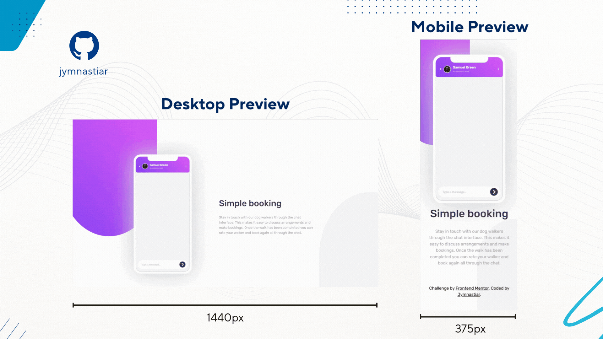

# Frontend Mentor - Chat app CSS illustration solution

This is a solution to the [Chat app CSS illustration challenge on Frontend Mentor](https://www.frontendmentor.io/challenges/chat-app-css-illustration-O5auMkFqY). Frontend Mentor challenges help you improve your coding skills by building realistic projects. 

## Table of contents

- [Overview](#overview)
  - [The challenge](#the-challenge)
  - [Screenshot](#screenshot)
  - [Links](#links)
- [My process](#my-process)
  - [Built with](#built-with)
  - [What I learned](#what-i-learned)
  - [Continued development](#continued-development)
  - [Useful resources](#useful-resources)
- [Author](#author)

## Overview

### The challenge

Users should be able to:

- View the optimal layout for the component depending on their device's screen size
- **Bonus**: See the chat interface animate on the initial load

### Screenshot



### Links

- [Solution URL](https://github.com/jymnastiar/chat-app-illustration-master)
- [Live Site URL](https://chat-app-illustration-jym.vercel.app/)

## My process

### Built with

- Semantic HTML5
- CSS custom properties
- Flexbox
- Mobile-first workflow
- Media queries
- CSS animations
- Font Awesome
- [Vercel](https://vercel.com/)
- [Git](https://git-scm.com/)

### What I learned

While working on this project, I learned how to enhance user experience using subtle CSS animations and how to debug interaction issues caused by overlapping decorative elements.

I implemented an initial load animation to make the chat interface feel more dynamic and polished.
```css
.phone {
  animation: phoneEnter 0.8s ease-out forwards;
}

@keyframes phoneEnter {
  from {
    opacity: 0;
    transform: translateY(40px) scale(0.95);
  }
  to {
    opacity: 1;
    transform: translateY(0) scale(1);
  }
}
```

Another important lesson was understanding how background elements can unintentionally block user interactions.
Although the decorative arch elements were visually behind the content, they still captured pointer events and prevented links from being clickable.

```css
.arch-container {
  pointer-events: none;
}
```


### Continued development

My plan to focus on improving UI animations, accessibility, and adding interactivity with JavaScript in future projects.

### Useful resources

- [Coding2GO](https://www.youtube.com/@coding2go) This channel helps a lot in mastering CSS.

## Author

- Frontend Mentor - [@jymnastiar](https://www.frontendmentor.io/profile/jymnastiar)